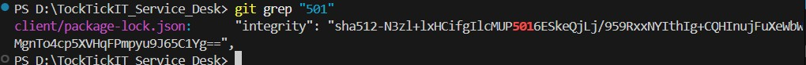

# Lab 1 — Peer Review Record  (fill this in)

**Author:** Sorawit Chaitong— 67070503442 — GitHub: @DEV4952
**Peer reviewer:** Phurithip Paisanworajit — 67070503437 — GitHub: @yiiipunn

## Pull Requests I authored (reviewed by my partner)
| PR | Branch | Reviewer verdict |
|----|--------|------------------|
| #5 | feature/1-project-foundation | approved |
| #6 | feature/2-health-check | approved |
| #7 | feature/3-category-seed | approved |
| #8 | feature/4-category-list | approved |

### ISSUE 1 Set up the TokTickIT project foundation.
Reviewer comment I received: Reviewed and tested Feature 1. Everything works as expected, and I didn't find any issues. Approved! ✅
How I responded: Thank you kub (after that i merged it in to lab1-staging)

## Pull Requests I reviewed for my partner
My comment: After I review now
Frontend is ☑
Backend is ☑
PostgreSQL & Prisma is ☑
Vitest & Supertest is ☑
Credential safe is ☑
README present is ☑
Partner's response: thx ka! (after that she merged her feature in to lab1-staging)

### ISSUE 2 implement API health check- #6
Reviewer comment I received: Reviewed and tested Feature 1. Everything works as expected, and I didn't find any issues. Approved! ✅
How I responded: Thank you kub (after that i merged it in to lab1-staging)

## Pull Requests I reviewed for my partner
My comment: I think i can't approve this yet because you need to remove 501 response, The endpoint current right now it sends both 501 and 200 responses at server/src/app.ts , Also in client/src/api.ts can you remove remove the throw here because it made fetch() code below can't work.

Partner's response: I think there might be a misunderstanding here. I checked server/src/app.ts again, and the current code only returns the 200 response. The 501 response hasn't been there at first.

I also searched for status(501) in the current branch and couldn't find any remaining occurrences. The 501 shown in package-lock.json is only part of an integrity hash and isn't related to the HTTP response.

I'll check the client/src/api.ts issue separately. Thanks for pointing it out!

Additionally, I checked the latest version of client/src/api.ts. The placeholder throw has already been removed.

Right now, fetch() runs first, and throw new Error("Unable to connect to TokTickIT API") only happens when the health response is not OK. So it does not block the fetch request.

For Issue 2, categories is intentionally returned as an empty array for now. The /api/categories fetch will be added later in Issue 4.

pls review it again 🥺

My comment: Sorry,after i review and check it again, i saw it and realized it my mistaken then you can commit it. Good work yiipunn

### ISSUE 3 categories
Reviewer comment I received: Checked the implementation and test results. Everything works as expected and the required categories are returned correctly. Looks good mak ka!
How I responded: Thank you so much

## Pull Requests I reviewed for my partner
My comment: After I review it
Category model - good
creates the Category table correctly - good
Seed inserts - good
Seed uses upsert, safe to run multiple times without duplicates - good
No credentials committed - good
look good to me , Good job
Partner's response: Thanks buddy!

### ISSUE 4 check-system-ui
Reviewer comment I received: Checked frontend connection to health and categories APIs ✅
Checked loading state ✅
Checked online/offline states ✅
Checked UI tests ✅
npm test passed ✅
Success and failure cases work as expected ✅

Everything looks good and matches the requirements. Approved!

Merge dai loeyyyy
How I responded: Thank you kubbbbbb

## Pull Requests I reviewed for my partner
My comment: Review
GET /api/categories reads from PostgreSQL via Prisma that ordered by id pass
have supertest verifies status, names, and id ordering pass
React renders categories from the real API response pass
Loading state and error state both show pass
Vitest covers success and error UI states pass
No credentials commit pass
Look good to me good work
Partner's response: Thank you!