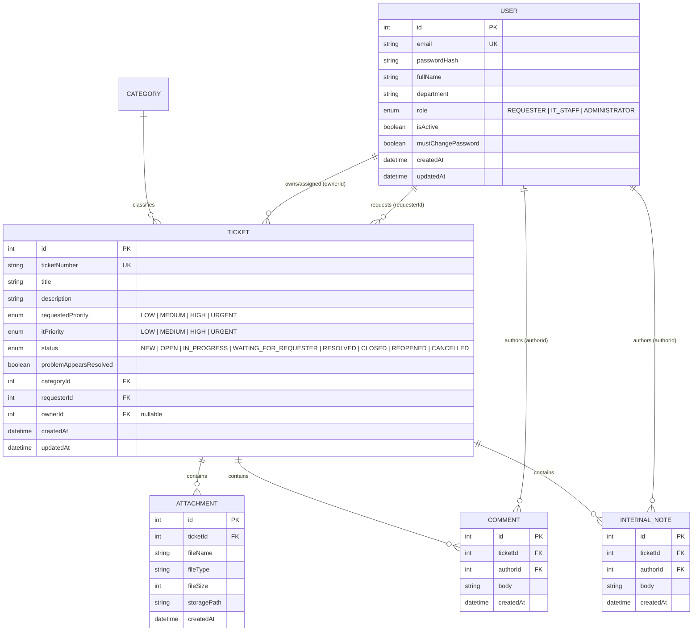

# TokTickIT Lab 3 — Engineering Specification

**Document Version:** 1.0.0  
**Status:** Approved for Implementation (Spec-DD Deliverable)  
**Target Sprint:** Lab 3 — TokTickIT Users, Roles, IT Staff Ticketing, and Admin Screens  
**Authors:** Sorawit Chaitong (@DEV4952), Phurithip Paisanworajit (@yiiipunn)  
**Course:** CPE 334 Introduction to Software Engineering in the Age of AI Agents (Semester 1/2026)  

---

## 1. Sprint Goal

Deliver a secure, role-governed, and enterprise-grade service management platform that transitions TokTickIT from a simulated development environment to a multi-role production-ready system. Lab 3 replaces the temporary Development Requester selector with real session/cookie-based authentication and robust server-side Role-Based Access Control (RBAC) across three distinct roles: **Requester**, **IT Staff**, and **Administrator**. 

The increment establishes:
1. Secure credential authentication with mandatory first-login password changes for initial credentials.
2. Unbroken continuation of all Lab 2 Requester capabilities under authenticated identity.
3. An operational IT Staff Ticket Queue with search, multi-faceted filtering, sorting, pagination, ticket detail inspection, ownership triage (claim/reassign), IT priority classification, and permitted status workflow transitions.
4. Segregated ticket communications distinguishing Public Comments from role-restricted Internal Notes.
5. A minimalist Administrator User Management console with account activation lifecycle and safety safeguards.

---

## 2. Stakeholder Request Interpretation

Stakeholders require evolving the successful Lab 2 ticketing MVP into a secure operational tool used by actual organizational staff:
- **Authentication & Identity:** The temporary persona switcher must be eliminated. Users must authenticate with their email and password. Newly provisioned users or users issued reset passwords must be forced to set a strong custom password before entering the application.
- **Requester Continuity & Collaboration:** Requesters must continue creating and viewing only their own tickets without regression. Additionally, Requesters need two-way communication via Public Comments on tickets and the ability to declare that a reported issue appears resolved to expedite closure.
- **IT Staff Operational Workflows:** IT agents require a centralized Ticket Queue to discover unassigned or team tickets, claim ownership, adjust IT priority based on technical triage, transition statuses through an approved lifecycle, publish Requester-visible comments, and record confidential internal investigation notes.
- **Administrator Governance:** System Administrators require an administrative portal to manage users (create accounts, assign one role, edit names/emails, toggle active status, and issue initial passwords) while preventing accidental system lockout (e.g., self-deactivation or removing the last active administrator).
- **Security & Integrity:** Security must be enforced on the backend via server-side session authentication and ownership checks. UI visual cues (hiding or disabling buttons) serve user experience only and are not considered security controls.

---

## 3. Scope

### 3.1. In-Scope
- **Authentication & Sessions:** Email/password authentication, secure session management, logout, current user profile retrieval (`/api/auth/me`), and mandatory first-login password change enforcement.
- **Data Migration & Schema Evolution:** Migration of Lab 2 development requester records into the unified `User` model, linking existing tickets/attachments, and adding `Comment`, `InternalNote`, and IT triage fields without data loss.
- **Role-Based Access Control (RBAC):** Server-side authorization middleware enforcing strict role boundaries (`Requester`, `IT_STAFF`, `ADMINISTRATOR`) and data ownership isolation.
- **Requester Experience:** Complete regression support for Lab 2 ticket creation and attachment management, addition of Public Comments, and a "Problem Appears Resolved" indication.
- **IT Staff Queue & Detail:** High-performance ticket queue with search, status/priority filtering, sorting, pagination, ticket claiming/reassignment, IT priority triage, status transitions, Public Comments, and Internal Notes.
- **Admin User Management:** Minimalist user list, search by name/email, role filtering, account creation with initial password, user detail editing, activation/deactivation, initial password resets, and safety validations.
- **Zen Green Design System:** Cohesive UI across desktop, tablet, and mobile with consistent badges, modals, empty states, and feedback toasts.

### 3.2. Explicitly Excluded (Out-of-Scope)
As mandated by Lab 3 Section 4.2:
- Email invitations, automated password-reset emails, multi-factor authentication (MFA), social logins, and SSO (SAML/OAuth2).
- Public self-registration (all accounts are created by Administrators).
- Actions Taken by IT Staff (formal service task logging deferred to Lab 4).
- Formal SLA calculation countdowns, automated escalation rules, and push/email notification engines.
- Advanced dashboards and KPI analytics beyond real-time queue count badges.
- Multi-tenant organizations, departments, customer billing, and profile pictures.
- User deletion, bulk user actions, CSV import/export, and audit log history tables.
- Multiple roles assigned to a single user (each user has exactly one role).
- Advanced user-list features such as multi-column sorting and complex simultaneous filter builders.

---

## 4. Functional Requirements

| Requirement ID | Module | Description |
|---|---|---|
| **FR-01** | **Authentication** | The system shall authenticate users using a valid email address and password, establishing a secure session and returning user profile information. |
| **FR-02** | **First-Login Change** | The system shall intercept logins for users flagged with `mustChangePassword = true` and restrict access exclusively to the Change Password screen until a new password satisfying complexity rules is saved. |
| **FR-03** | **Session & Logout** | The system shall provide a current user endpoint (`/api/auth/me`) and an invalidating logout endpoint (`/api/auth/logout`) that clears active session credentials. |
| **FR-04** | **Requester Regression** | The system shall allow authenticated Requesters to create tickets, list their owned tickets, and manage attachments without relying on client-supplied `requesterId` headers. |
| **FR-05** | **Requester Resolution** | The system shall allow Requesters to submit a "Problem Appears Resolved" indication on their owned active tickets. |
| **FR-06** | **IT Ticket Queue** | The system shall provide IT Staff and Administrators with a paginated queue of all tickets supporting substring search, status/priority filters, column sorting, and unassigned/assigned indicators. |
| **FR-07** | **Ticket Ownership** | The system shall allow IT Staff and Administrators to claim an unassigned ticket or reassign a ticket to any active IT Staff or Administrator account. |
| **FR-08** | **IT Priority Triage** | The system shall allow IT Staff and Administrators to set and update the `itPriority` field independently of the Requester's original `requestedPriority`. |
| **FR-09** | **Status Transition** | The system shall enforce a state machine allowing IT Staff and Administrators to transition tickets between valid lifecycle statuses (`NEW`, `OPEN`, `IN_PROGRESS`, `WAITING_FOR_REQUESTER`, `RESOLVED`, `CLOSED`, `REOPENED`, `CANCELLED`). |
| **FR-10** | **Public Comments** | The system shall allow Requesters (on owned tickets), IT Staff, and Administrators to post and view append-only Public Comments with author timestamps. |
| **FR-11** | **Internal Notes** | The system shall allow IT Staff and Administrators to create and view confidential, append-only Internal Notes on any ticket, strictly forbidding Requester access. |
| **FR-12** | **Admin User Listing** | The system shall allow Administrators to view a list of all system users with name/email search and optional role filtering. |
| **FR-13** | **Admin User Creation** | The system shall allow Administrators to create a user specifying Name, Email, exactly one Role, initial Activation status, and an Initial Password (flagging `mustChangePassword = true`). |
| **FR-14** | **Admin User Update** | The system shall allow Administrators to update an existing user's Name, Email, Role, and Active status. |
| **FR-15** | **Admin Password Reset**| The system shall allow Administrators to set a new initial password for any user account, forcing a password change on that user's next login. |
| **FR-16** | **Admin Safety Locks** | The system shall block any attempt by an Administrator to deactivate their own account or modify the system such that zero active Administrators remain. |

---

## 5. Business Rules

| Rule ID | Domain | Business Rule Statement |
|---|---|---|
| **BR-01** | **Authentication** | Only active user accounts (`isActive = true`) with valid password credentials may authenticate. Inactive accounts receive an uninformative invalid credentials or inactive account error without leaking user existence. |
| **BR-02** | **Password Change** | A user marked with `mustChangePassword = true` is barred from navigating to any application screen or invoking protected business endpoints until a new password (min 8 characters, upper, lower, number, special char) is verified and saved. |
| **BR-03** | **Requester Identity** | The authenticated user session identity permanently determines ticket creation, ownership queries, and attachment access. Client-supplied `requesterId` in request bodies or query params is ignored or rejected. |
| **BR-04** | **Comment Visibility** | Public Comments are visible to the Ticket Requester, all IT Staff, and Administrators. Internal Notes are strictly restricted to IT Staff and Administrators; Requesters querying Internal Note endpoints receive `403 Forbidden` with zero note content exposed. |
| **BR-05** | **Ticket Resolution** | A Requester may submit an indication that the problem appears resolved, but only IT Staff or Administrators may formally update the ticket status to `RESOLVED` or `CLOSED`. |
| **BR-06** | **Role Exclusivity** | Each user in the system is assigned exactly one role from the enum `[REQUESTER, IT_STAFF, ADMINISTRATOR]`. Multiple role assignments are prohibited. |
| **BR-07** | **Ticket Assignment** | A ticket may have zero (unassigned) or one primary Ticket Owner. Only active users with role `IT_STAFF` or `ADMINISTRATOR` may be assigned as Ticket Owners. |
| **BR-08** | **IT Priority Defaults** | When a ticket is created by a Requester, `itPriority` is initially initialized to copy `requestedPriority`. Subsequent modifications to `itPriority` can only be performed by IT Staff or Administrators. |
| **BR-09** | **Status Transitions** | Ticket status progression follows an explicit transition matrix:  • `NEW` ➔ `OPEN`, `IN_PROGRESS`, `CANCELLED` • `OPEN` ➔ `IN_PROGRESS`, `WAITING_FOR_REQUESTER`, `RESOLVED`, `CANCELLED` • `IN_PROGRESS` ➔ `WAITING_FOR_REQUESTER`, `RESOLVED`, `CANCELLED` • `WAITING_FOR_REQUESTER` ➔ `IN_PROGRESS`, `RESOLVED`, `CANCELLED` • `RESOLVED` ➔ `CLOSED`, `REOPENED` • `CLOSED` ➔ `REOPENED` • `REOPENED` ➔ `IN_PROGRESS`, `RESOLVED` • `CANCELLED` ➔ (Terminal state, no transitions permitted). |
| **BR-10** | **Comment Immutability** | Public Comments and Internal Notes are append-only. Once created, neither the author nor administrators can edit or delete comment/note records. Empty or whitespace-only content is rejected (min 1 char, max 2000 chars). |
| **BR-11** | **Email Uniqueness** | Every user email must be globally unique across all accounts (case-insensitive). Duplicate email creation or modification must be rejected with `409 Conflict` or `422 Unprocessable Entity`. |
| **BR-12** | **Admin Self-Protection** | An Administrator cannot deactivate their own active account (`isActive = false`) or change their own role away from `ADMINISTRATOR`. |
| **BR-13** | **Last Admin Protection**| The system must prevent deactivating or reassigning the role of the final remaining active Administrator in the database. |
| **BR-14** | **No User Deletion** | Deletion of user records (`DELETE /api/users/:id`) is disallowed to preserve historical integrity across tickets, attachments, comments, and notes. Account suspension must be accomplished exclusively via `isActive = false`. |
| **BR-15** | **Safe Error Responses** | Unauthenticated requests receive `401 Unauthorized`. Authenticated requests attempting unauthorized actions receive `403 Forbidden`. Requests targeting non-existent or foreign owned resources receive `404 Not Found` without disclosing existence. |

---

## 6. Authorization Matrix

| Action / Resource | Requester (Owner) | Requester (Non-Owner) | IT Staff | Administrator | Unauthenticated |
|---|:---:|:---:|:---:|:---:|:---:|
| **Login / Auth Status** | ✅ | ✅ | ✅ | ✅ | ✅ (Login only) |
| **Change Own Password** | ✅ | ✅ | ✅ | ✅ | ❌ (401) |
| **Create Ticket** | ✅ | ✅ | ✅ | ✅ | ❌ (401) |
| **View Owned Tickets List** | ✅ | ❌ (Own only) | ✅ | ✅ | ❌ (401) |
| **View Ticket Detail** | ✅ | ❌ (404/403) | ✅ | ✅ | ❌ (401) |
| **View IT Staff Queue** | ❌ (403) | ❌ (403) | ✅ | ✅ | ❌ (401) |
| **Claim / Reassign Ticket** | ❌ (403) | ❌ (403) | ✅ | ✅ | ❌ (401) |
| **Update IT Priority** | ❌ (403) | ❌ (403) | ✅ | ✅ | ❌ (401) |
| **Update Ticket Status** | ❌ (403)* | ❌ (403) | ✅ | ✅ | ❌ (401) |
| **Indicate Problem Resolved**| ✅ | ❌ (403) | ✅ | ✅ | ❌ (401) |
| **View Public Comments** | ✅ | ❌ (404/403) | ✅ | ✅ | ❌ (401) |
| **Post Public Comment** | ✅ | ❌ (404/403) | ✅ | ✅ | ❌ (401) |
| **View Internal Notes** | ❌ (403) | ❌ (403) | ✅ | ✅ | ❌ (401) |
| **Create Internal Note** | ❌ (403) | ❌ (403) | ✅ | ✅ | ❌ (401) |
| **List Users (Admin)** | ❌ (403) | ❌ (403) | ❌ (403) | ✅ | ❌ (401) |
| **Create / Edit Users** | ❌ (403) | ❌ (403) | ❌ (403) | ✅ | ❌ (401) |
| **Reset User Password** | ❌ (403) | ❌ (403) | ❌ (403) | ✅ | ❌ (401) |

*\*Note: Requesters trigger the "Problem Appears Resolved" flag via a dedicated endpoint, but cannot set status to `RESOLVED` directly.*

---

## 7. Data Changes & Migration Strategy

### 7.1. Entity Relationship Model

### 7.2. Migration Strategy from Lab 2
1. **User Migration:** Convert existing Lab 2 seeded Development Requester identities into the new `User` table with role `REQUESTER`, secure bcrypt password hashes, and initial passwords.
2. **Foreign Key Integrity:** Re-link the `Ticket.requesterId` foreign key to `User.id` preserving 100% of tickets and diagnostic attachments created in Lab 2.
3. **New Workflow Columns:** Add `itPriority` (initialized from `requestedPriority`), `ownerId` (nullable, referencing `User.id`), and `problemAppearsResolved` (default `false`) to `Ticket`.
4. **New Communication Tables:** Create `Comment` and `InternalNote` tables with cascading foreign keys to `Ticket` and `User`.
5. **Idempotent Seed Strategy:** Seed script runs safely using `upsert` queries to seed:
   - ≥4 Active Requesters + 1 Inactive Requester.
   - ≥3 Active IT Staff + 1 Inactive IT Staff.
   - ≥1 Active Administrator account.
   - Realistic tickets spanning various statuses, priorities, and assigned/unassigned states.
   - Example Public Comments and Internal Notes.

---

## 8. REST API Contract Summary

Complete endpoint specifications, payload schemas, and responses are detailed in `docs/lab-03/api-spec.md`. Key endpoint groups:

- **Auth:**
  - `POST /api/auth/login` (email, password)
  - `POST /api/auth/logout`
  - `GET /api/auth/me`
  - `POST /api/auth/change-password` (currentPassword, newPassword, confirmPassword)
- **Requester Ticketing (Retained & Secured):**
  - `GET /api/categories`
  - `POST /api/tickets` (Multipart form-data)
  - `GET /api/tickets` (Filtered by session `requesterId`)
  - `GET /api/tickets/:id` (Ownership enforced)
  - `POST /api/tickets/:id/resolve-indication` (Sets `problemAppearsResolved = true`)
- **IT Staff Queue & Ticket Actions:**
  - `GET /api/staff/tickets` (Query: `page`, `limit`, `search`, `status`, `priority`, `ownerId`, `sortBy`, `sortDir`)
  - `GET /api/staff/tickets/:id`
  - `PATCH /api/staff/tickets/:id/claim`
  - `PATCH /api/staff/tickets/:id/reassign` (`ownerId`)
  - `PATCH /api/staff/tickets/:id/priority` (`itPriority`)
  - `PATCH /api/staff/tickets/:id/status` (`status`, optional note/comment)
- **Comments & Notes:**
  - `GET /api/tickets/:id/comments` (Public to owner, IT staff, admin)
  - `POST /api/tickets/:id/comments` (body text)
  - `GET /api/tickets/:id/notes` (IT staff and admin only)
  - `POST /api/tickets/:id/notes` (IT staff and admin only)
- **Admin User Management:**
  - `GET /api/admin/users` (Query: `search`, `role`, `isActive`)
  - `POST /api/admin/users` (email, fullName, department, role, isActive, initialPassword)
  - `PATCH /api/admin/users/:id` (fullName, email, role, isActive)
  - `POST /api/admin/users/:id/reset-password` (newInitialPassword)

---

## 9. Acceptance Criteria

| ID | Given | When | Then |
|---|---|---|---|
| **AC-01** | An active user with valid credentials | The user submits email and password on `/login` | The system creates an authenticated session and returns user identity and role. |
| **AC-02** | An active user with `mustChangePassword = true` | The user successfully authenticates | The system restricts navigation exclusively to the Change Password screen until a valid new password is saved. |
| **AC-03** | An authenticated Requester | The client sends a request supplying another user's `requesterId` | The backend uses the authenticated session identity and ignores the foreign `requesterId`. |
| **AC-04** | An authenticated Requester | The user attempts to request the Internal Notes endpoint `/api/tickets/:id/notes` | The backend responds with `403 Forbidden` and leaks zero internal note data. |
| **AC-05** | An authenticated IT Staff member | The staff navigates to `/staff/queue` | The system renders the shared Ticket Queue with operational badges, search, filter, and sort controls. |
| **AC-06** | An authenticated IT Staff member | The staff clicks "Claim Ticket" on an unassigned ticket | The backend sets `ownerId` to the current staff user and updates the ticket view. |
| **AC-07** | An authenticated IT Staff member | The staff updates the IT Priority to `URGENT` | The backend persists `itPriority = URGENT` without altering the original `requestedPriority`. |
| **AC-08** | An authenticated IT Staff member | The staff updates ticket status from `OPEN` to `IN_PROGRESS` | The backend validates the transition and updates the ticket status history. |
| **AC-09** | A Requester on an owned open ticket | The Requester clicks "Problem Appears Resolved" | The backend marks `problemAppearsResolved = true` and posts an automated system comment without formally closing the ticket. |
| **AC-10** | An authenticated IT Staff or Requester | The user posts a Public Comment | The comment is saved with the current user's author identity and timestamp, visible to all participants. |
| **AC-11** | An authenticated Administrator | The admin opens User Management `/admin/users` | The system renders the user table with search, role filters, and an "Add User" action. |
| **AC-12** | An authenticated Administrator | The admin creates a new user with role `IT_STAFF` | The user is persisted with hashed initial password and `mustChangePassword = true`. |
| **AC-13** | An authenticated Administrator | The admin attempts to deactivate their own account | The backend and UI reject the operation with a safety validation error. |
| **AC-14** | An authenticated Administrator | The admin attempts to deactivate the sole remaining active admin | The system rejects the operation with a protected policy conflict error. |
| **AC-15** | An unauthenticated user | The user attempts to access any protected `/api/*` route | The backend responds with `401 Unauthorized`. |

---

## 10. Product Definition of Done (DoD)

A feature or sub-system within Sprint 3 is declared **Done** only when all the following criteria are satisfied:
1. **Specification Alignment:** All functional requirements (`FR-01` to `FR-16`) and business rules (`BR-01` to `BR-15`) are fully implemented and verified.
2. **Server-Side Security:** Every protected route enforces RBAC and session checks on the server. No security relies solely on client-side hidden UI elements.
3. **Backward Compatibility:** All Lab 2 Requester workflows, tickets, categories, and attachments remain functional without regressions.
4. **Data Integrity:** Database schema migration executes cleanly via Prisma migrations, and the seed script is verified to be 100% idempotent.
5. **Testing Coverage:** Automated test suites pass on `main`:
   - Server Unit & API tests (`server/tests/lab-03/*.test.ts`)
   - Client Component tests (`client/.../lab-03/*.test.tsx`)
   - Playwright End-to-End tests (`e2e/lab-03/*.spec.ts`)
6. **Zen Green UI & Accessibility:** Responsive design verified on Mobile (375px), Tablet (768px), and Desktop (1440px) with zero horizontal overflow, appropriate badge colors, and clear loading/error feedback.
7. **Engineering Workflow:** All commits belong to feature branches, reviewed and approved via Pull Requests into `lab3-staging`, documented in `docs/lab-03/reviewer.md`, and merged cleanly into `main`.

---

## 11. Assumptions and Architectural Decisions

1. **Session & Cookie Architecture:** Sessions are managed using HTTP-only, secure, `SameSite=Lax` session cookies (`toktick_session`) or Bearer tokens storing signed user identity, preventing XSS credential theft.
2. **Password Cryptography:** Passwords are never stored in plaintext. Password hashing uses standard `bcrypt` with a minimum salt round of 10.
3. **Password Policy:** Passwords must have a minimum length of 8 characters and include at least one uppercase letter, one lowercase letter, one numeric digit, and one special character.
4. **Soft Deactivation Pattern:** Users are never deleted from the database (`DELETE`), ensuring historical ticket ownership and comment attribution records remain unbroken.
5. **Separation of Concerns:** Administrators govern user identity and roles; IT Staff manage ticketing queues and technical investigations. Administrators do not automatically triage tickets unless explicitly acting as assigned staff.
